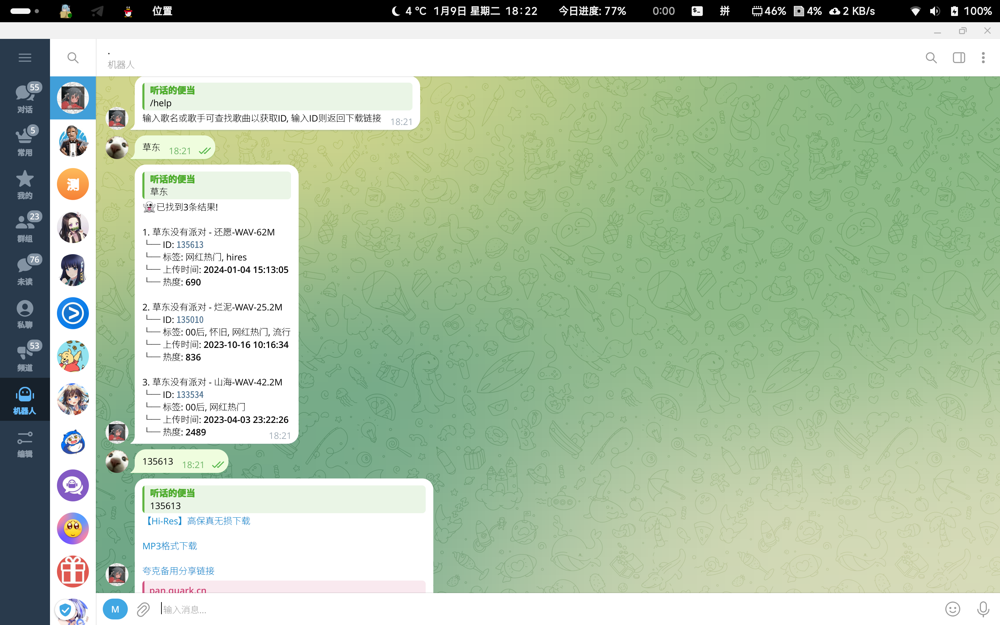

# 熊猫无损音乐bot

找无损音乐的时候发现了这个很好用的网站, 下载无损音乐非常方便(无广告, 音频文件在迅雷盘里, 且音频质量很好).

于是想做一个tg bot, 更快速的获取下载链接.



## 安装

clone此仓库.

安装以下依赖:

```sh
pip3 install requests beautifulsoup4 pyTelegramBotAPI html5lib
```

运行安装脚本:

```sh
sh install.sh
```
过程中会弹出nano编辑器, 填写bot的token后退出即可.

启动bot:

```sh
python3 app.py
```

## 使用

* 对bot直接发歌名/歌手, 会返回相关信息;
* 对bot发ID, 即可获取下载链接(ID在相关信息里, 是等宽字体, 点击即可复制).

## 相关

无注释, xm_api.py是api相关的文件, 以后会加排行榜什么东西的吧, 不过感觉没太大必要...